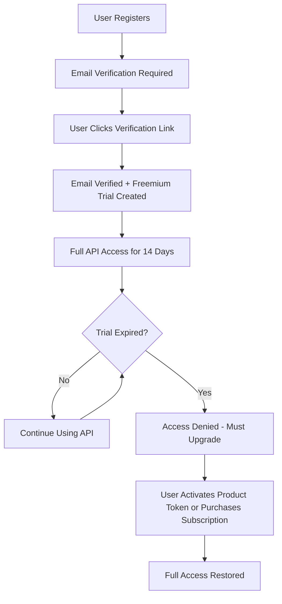
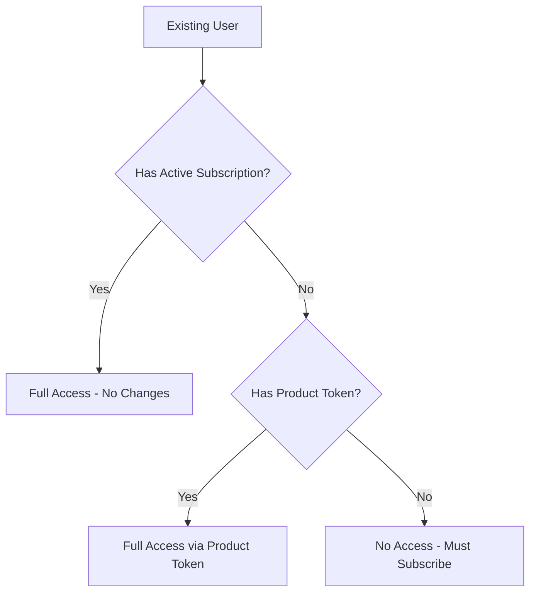

# Freemium Trial System Documentation

## Overview

The NutriBox API now includes a **2-week freemium trial system** that automatically grants new users full access to all features upon email verification. This document provides comprehensive guidance for frontend developers on how to integrate with this new system.

## Table of Contents

1. [System Overview](#system-overview)
2. [User Flow](#user-flow)
3. [API Changes](#api-changes)
4. [Authentication & Authorization](#authentication--authorization)
5. [Error Handling](#error-handling)
6. [Frontend Integration Guide](#frontend-integration-guide)
7. [Testing](#testing)
8. [Migration Guide](#migration-guide)
9. [Troubleshooting](#troubleshooting)

## System Overview

### What Changed

- **New Users**: Automatically receive a 2-week freemium trial after email verification
- **Existing Users**: No changes to their current access (subscription or product token)
- **Access Control**: New middleware handles freemium, subscription, and product token access
- **Trial Duration**: 14 days from email verification
- **Features**: Full access to all features during trial period

### Key Benefits

- ✅ **Zero Friction**: New users get immediate access without payment or product token
- ✅ **Full Features**: Complete access to all API endpoints during trial
- ✅ **Automatic Expiry**: Trial automatically expires after 14 days
- ✅ **Seamless Upgrade**: Users can activate product token or purchase subscription anytime
- ✅ **Backwards Compatible**: Existing users unaffected

## User Flow

### New User Registration Flow



### Existing User Flow



## API Changes

### New Endpoints

No new endpoints were added. All existing endpoints now support freemium access.

### Modified Behavior

#### Authentication Flow

**Before:**
- Required: Valid JWT + (Active Subscription OR Product Token)

**After:**
- Required: Valid JWT + (Active Subscription OR Product Token OR Active Freemium Trial)

### Access Control Matrix

| User Type | JWT Required | Access Granted | Duration |
|-----------|-------------|----------------|----------|
| **Freemium Trial** | ✅ | Full Features | 14 days |
| **Paid Subscription** | ✅ | Full Features | Until expiry |
| **Product Token** | ✅ | Full Features | Until expiry |
| **Expired Freemium** | ✅ | ❌ Denied | - |
| **No Access** | ✅ | ❌ Denied | - |
| **No JWT** | ❌ | ❌ Unauthorized | - |

## Authentication & Authorization

### JWT Token Structure

JWT tokens now include subscription information:

```json
{
  "sub": "user-uuid",
  "iat": 1640995200,
  "exp": 1640998800,
  "type": "access",
  "userData": {
    "id": "user-uuid",
    "name": "John Doe",
    "email": "john@example.com",
    "role": "user",
    "verified_email": true,
    "isProductTokenVerified": false,
    "subscriptionFeatures": {
      "scan_ai": true,
      "scan_calorie": true,
      "chatbot": true,
      "bmi_check": true,
      "weight_tracking": true,
      "health_info": true
    }
  }
}
```

### Authorization Headers

All API requests must include the JWT token:

```http
Authorization: Bearer <jwt-token>
```

## Error Handling

### New Error Responses

#### Freemium Trial Expired (403)

```json
{
  "status": "error",
  "message": "freemium_expired",
  "error": "Your freemium trial has expired. Please activate a product token or purchase a subscription.",
  "data": {
    "upgrade_url": "/v1/subscriptions/plans"
  }
}
```

#### Access Required (403)

```json
{
  "status": "error",
  "message": "access_required", 
  "error": "Access denied. Please activate a product token or purchase a subscription.",
  "data": {
    "upgrade_url": "/v1/subscriptions/plans"
  }
}
```

#### Unauthorized (401)

```json
{
  "status": "error",
  "message": "Please authenticate",
  "error": "Please authenticate"
}
```

### Error Handling Best Practices

```javascript
// Frontend error handling example
const handleApiError = (error) => {
  const { status, message, data } = error.response.data;
  
  switch (message) {
    case 'freemium_expired':
      // Show upgrade modal with trial expiry message
      showUpgradeModal({
        title: 'Trial Expired',
        message: 'Your 2-week trial has ended. Upgrade to continue using NutriBox.',
        upgradeUrl: data.upgrade_url
      });
      break;
      
    case 'access_required':
      // Show upgrade modal for new users
      showUpgradeModal({
        title: 'Upgrade Required',
        message: 'Activate a product token or purchase a subscription to access NutriBox.',
        upgradeUrl: data.upgrade_url
      });
      break;
      
    case 'Please authenticate':
      // Redirect to login
      redirectToLogin();
      break;
      
    default:
      // Handle other errors
      showGenericError(error.response.data.error);
  }
};
```

## Frontend Integration Guide

### 1. User Registration Flow

```javascript
// Registration with freemium trial creation
const registerUser = async (userData) => {
  try {
    const response = await api.post('/v1/auth/register', userData);
    
    // Show success message with verification reminder
    showSuccessMessage(
      'Registration successful! Please check your email to verify your account and start your 2-week free trial.'
    );
    
    return response.data;
  } catch (error) {
    handleRegistrationError(error);
  }
};
```

### 2. Email Verification Handling

```javascript
// Handle email verification
const verifyEmail = async (token) => {
  try {
    const response = await api.get(`/v1/auth/verify-email?token=${token}`);
    
    // Show success message with trial information
    showSuccessMessage(
      'Email verified successfully! You now have a 2-week free trial with full access to all features.'
    );
    
    // Optionally redirect to main app
    redirectToApp();
    
    return response.data;
  } catch (error) {
    handleVerificationError(error);
  }
};
```

### 3. Access Control in Frontend

```javascript
// Check user access level
const getUserAccessLevel = (user) => {
  const features = user.subscriptionFeatures || {};
  
  if (user.isProductTokenVerified) {
    return { type: 'product_token', features, unlimited: true };
  }
  
  if (features.scan_ai) {
    // Check if it's freemium (14 days) or paid subscription
    const isFreemium = user.subscriptionType === 'freemium';
    return { 
      type: isFreemium ? 'freemium' : 'subscription', 
      features,
      unlimited: false 
    };
  }
  
  return { type: 'none', features: {}, unlimited: false };
};
```

### 4. Trial Status Display

```javascript
// Show trial status to user
const TrialStatusComponent = ({ user }) => {
  const accessLevel = getUserAccessLevel(user);
  
  if (accessLevel.type === 'freemium') {
    const daysRemaining = calculateDaysRemaining(user.trialEndDate);
    
    return (
      <div className="trial-status">
        <h3>Free Trial Active</h3>
        <p>{daysRemaining} days remaining</p>
        <button onClick={showUpgradeOptions}>
          Upgrade to Continue
        </button>
      </div>
    );
  }
  
  if (accessLevel.type === 'subscription') {
    return (
      <div className="subscription-status">
        <h3>Premium Subscription Active</h3>
        <p>Expires: {formatDate(user.subscriptionEndDate)}</p>
      </div>
    );
  }
  
  return (
    <div className="upgrade-prompt">
      <h3>Upgrade Required</h3>
      <p>Activate a product token or purchase a subscription to continue.</p>
      <button onClick={showUpgradeOptions}>
        View Plans
      </button>
    </div>
  );
};
```

### 5. API Request Interceptor

```javascript
// Axios interceptor for handling access errors
api.interceptors.response.use(
  (response) => response,
  (error) => {
    if (error.response?.status === 403) {
      const { message } = error.response.data;
      
      if (message === 'freemium_expired' || message === 'access_required') {
        // Show upgrade modal instead of generic error
        showUpgradeModal();
        return Promise.reject(error);
      }
    }
    
    return Promise.reject(error);
  }
);
```

### 6. Subscription Management

```javascript
// Get subscription plans
const getSubscriptionPlans = async () => {
  try {
    const response = await api.get('/v1/subscriptions/plans');
    return response.data.results;
  } catch (error) {
    handleApiError(error);
  }
};

// Purchase subscription
const purchaseSubscription = async (planId, paymentMethod) => {
  try {
    const response = await api.post('/v1/subscriptions/purchase', {
      plan_id: planId,
      payment_method: paymentMethod
    });
    
    // Handle payment redirect
    if (response.data.redirect_url) {
      window.location.href = response.data.redirect_url;
    }
    
    return response.data;
  } catch (error) {
    handleApiError(error);
  }
};

// Activate product token
const activateProductToken = async (token) => {
  try {
    const response = await api.post('/v1/auth/verify-product-token', {
      token: token
    });
    
    showSuccessMessage('Product token activated successfully!');
    return response.data;
  } catch (error) {
    handleApiError(error);
  }
};
```

## Testing

### Test Environment Setup

The freemium system includes comprehensive tests. Use these Makefile commands:

```bash
# Run freemium tests (no database required)
make test-freemium-no-db

# Run all freemium tests (requires database)
make test-freemium

# Show all test commands
make test-help
```

### Frontend Testing Scenarios

Test these user scenarios:

1. **New User Registration**
   - Register → Verify email → Access granted
   - Verify trial features are available
   - Check trial countdown display

2. **Trial Expiry**
   - Simulate expired trial
   - Verify upgrade prompts appear
   - Test upgrade flow completion

3. **Existing User**
   - Login with existing subscription
   - Verify no changes to access
   - Test product token activation

4. **Error Handling**
   - Test 403 responses with proper error messages
   - Verify upgrade modals appear
   - Test authentication flow

## Migration Guide

### For Existing Frontend Applications

#### 1. Update Error Handling

```javascript
// Before
const handleError = (error) => {
  if (error.status === 403) {
    showGenericError('Access denied');
  }
};

// After
const handleError = (error) => {
  if (error.status === 403) {
    const { message, data } = error.response.data;
    
    if (message === 'freemium_expired' || message === 'access_required') {
      showUpgradeModal(data.upgrade_url);
    } else {
      showGenericError('Access denied');
    }
  }
};
```

#### 2. Update User Status Display

```javascript
// Before
const UserStatus = ({ user }) => {
  if (user.hasSubscription) {
    return <div>Premium User</div>;
  }
  return <div>Free User</div>;
};

// After
const UserStatus = ({ user }) => {
  const accessLevel = getUserAccessLevel(user);
  
  switch (accessLevel.type) {
    case 'freemium':
      return <FreemiumTrialStatus user={user} />;
    case 'subscription':
      return <PremiumSubscriptionStatus user={user} />;
    case 'product_token':
      return <ProductTokenStatus user={user} />;
    default:
      return <UpgradePrompt />;
  }
};
```

#### 3. Update Registration Flow

```javascript
// Before
const registerUser = async (userData) => {
  const response = await api.post('/v1/auth/register', userData);
  showMessage('Registration successful! Please verify your email.');
};

// After
const registerUser = async (userData) => {
  const response = await api.post('/v1/auth/register', userData);
  showMessage(
    'Registration successful! Please verify your email to start your 2-week free trial.'
  );
};
```

## Troubleshooting

### Common Issues

#### 1. "Please authenticate" Error

**Cause**: Missing or invalid JWT token
**Solution**: 
- Check if user is logged in
- Verify JWT token is included in Authorization header
- Refresh token if expired

#### 2. "freemium_expired" Error

**Cause**: User's 2-week trial has ended
**Solution**:
- Show upgrade modal
- Provide subscription plans or product token activation

#### 3. "access_required" Error

**Cause**: User has no active subscription or product token
**Solution**:
- Show upgrade options
- Provide clear path to subscription or product token activation

#### 4. Features Not Available

**Cause**: User doesn't have required feature access
**Solution**:
- Check `subscriptionFeatures` in JWT token
- Verify user has active freemium trial or subscription
- Guide user to upgrade if needed

### Debug Information

Include these headers in API requests for debugging:

```javascript
const debugHeaders = {
  'X-Debug-User-ID': user.id,
  'X-Debug-Access-Type': accessLevel.type,
  'X-Debug-Features': JSON.stringify(accessLevel.features)
};
```

### Logging

Log these events for monitoring:

```javascript
// Track freemium trial events
analytics.track('freemium_trial_started', {
  user_id: user.id,
  trial_start_date: new Date().toISOString()
});

analytics.track('freemium_trial_expired', {
  user_id: user.id,
  trial_end_date: user.trialEndDate
});

analytics.track('upgrade_prompted', {
  user_id: user.id,
  prompt_type: 'trial_expired' // or 'access_required'
});
```

## API Reference

### Updated Endpoints

All existing endpoints now support freemium access. No new endpoints were added.

### Response Formats

#### Success Response
```json
{
  "status": "success",
  "message": "Operation completed successfully",
  "data": { ... }
}
```

#### Error Response
```json
{
  "status": "error",
  "message": "error_code",
  "error": "Human readable error message",
  "data": {
    "upgrade_url": "/v1/subscriptions/plans"
  }
}
```

### Status Codes

- **200**: Success
- **201**: Created (registration, etc.)
- **401**: Unauthorized (invalid/missing JWT)
- **403**: Forbidden (no access, trial expired)
- **404**: Not Found
- **500**: Internal Server Error

## Support

For technical support or questions about the freemium trial system:

1. Check this documentation first
2. Review the API error responses
3. Test with the provided test commands
4. Contact the backend team with specific error details

---

**Last Updated**: October 20, 2025  
**Version**: 1.0.0  
**API Version**: v1
